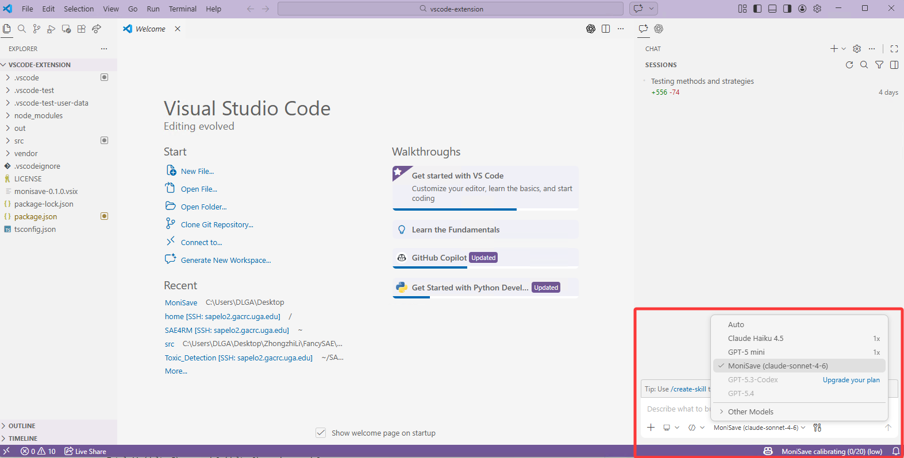
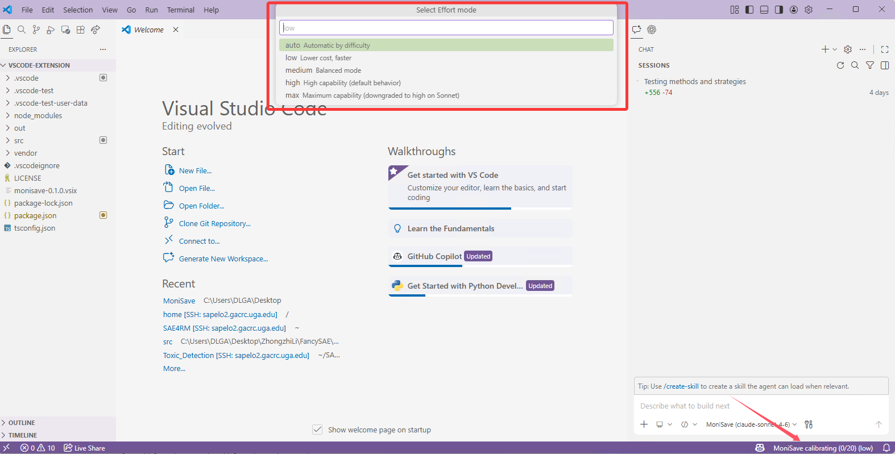
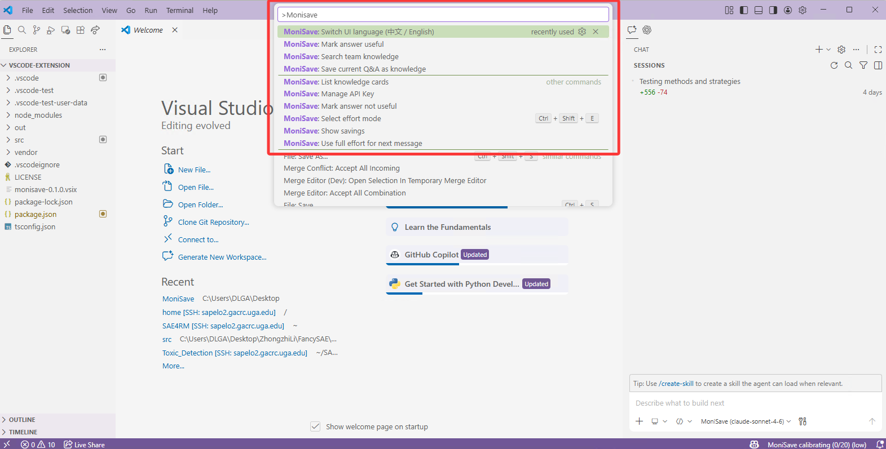
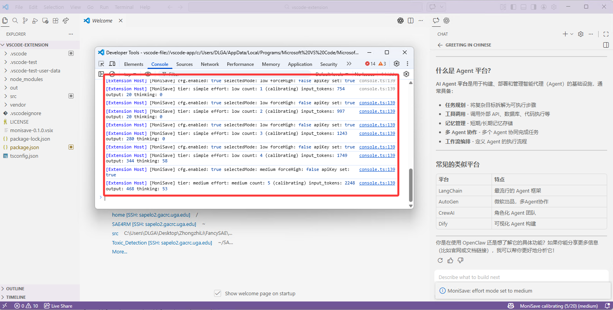
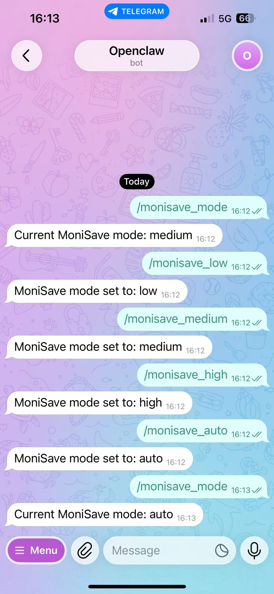

# MoniSave

**Stop wasting money on thinking tokens you don't need.**

MoniSave connects Claude's extended thinking to VS Code and OpenClaw — and lets you control exactly how much reasoning each message gets.

> ⚠️ **Difficulty auto-detection is under active development and not yet available.** Manual effort switching and all other features are fully functional.

---

## What it does

| | VS Code | OpenClaw (Telegram) |
|--|---------|---------------------|
| Choose effort per message | ✅ Click status bar or `Ctrl+Shift+E` | ✅ `/monisave_low`, `/monisave_high` … |
| See real-time token savings | ✅ Status bar | ✅ `/savings` |
| Save team knowledge | ✅ `@monisave /save` | — |
| Switch language (中/EN) | ✅ One command | — |

---

## VS Code

### 1 — Pick the model

Open VS Code Chat and select **MoniSave (Claude Sonnet + thinking)**.



### 2 — Switch effort in one click

Click the status bar or press **`Ctrl+Shift+E`** to open the effort picker.



Or use the command palette (`Ctrl+Shift+P` → type **MoniSave**):



### 3 — Use @monisave for team knowledge

In Chat, type `@monisave /` to see all knowledge commands:


| Command | What it does |
|---------|-------------|
| `/save` | Save the last Q&A as a knowledge card |
| `/search <keywords>` | Find relevant cards |
| `/list` | Show all cards |
| `/useful` · `/notuseful` | Rate the last answer |

### 4 — Verify it's working

Open **Help → Toggle Developer Tools → Console** and filter by `MoniSave`:



Every request logs `tier · effort · input_tokens · thinking` so you can confirm the right effort level was used.

### Setup

```
1. Install from the VS Code Marketplace (search "MoniSave")
2. Run "MoniSave: Manage API Key" and enter your Anthropic key
3. Select MoniSave model in Chat — done
```

**Key settings:**

| Setting | Default | Options |
|---------|---------|---------|
| `monisave.effortMode` | `auto` | auto / low / medium / high / max |
| `monisave.currency` | `usd` | usd / cny |
| `monisave.language` | `en` | en / zh |
| `monisave.showEffortOnSend` | `true` | Show effort used per request |

---

## OpenClaw

MoniSave runs as a plugin inside your OpenClaw bot (Telegram or similar).

### Switching effort



```
/monisave_mode        → show current mode
/monisave_low         → force low effort
/monisave_medium      → force medium effort
/monisave_high        → force high effort
/monisave_auto        → back to auto
/savings              → session token savings
```

### Install

```bash
npm run build   # from repo root
# then load packages/openclaw-plugin per your OpenClaw docs
```

**Config** (`CONFIG.example.md`):

```json
{
  "plugin": "monisave",
  "models": {
    "simple":  "your-low-effort-model-id",
    "medium":  "your-mid-effort-model-id",
    "complex": "your-high-effort-model-id"
  }
}
```

---

## Roadmap

- [ ] **Difficulty auto-detection** *(in development)* — heuristic classifier to pick effort automatically based on prompt complexity
- [x] Manual effort switching (VS Code + OpenClaw)
- [x] Real-time token savings in status bar
- [x] Team knowledge cards (`@monisave`)
- [x] Chinese / English UI

---

## License

Apache-2.0
